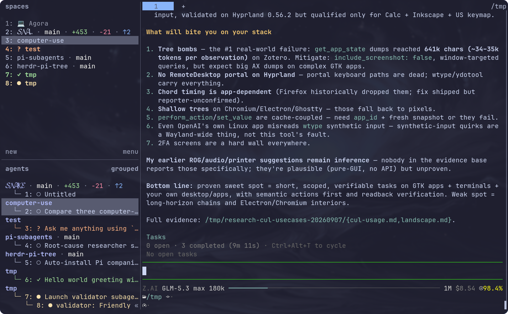

# Herdr Pi Tree

Tree sidebar for Pi agents in Herdr: nested subagents, worktree branches,
colored git stats, and focus indices. A resident Node daemon renders sidebar
and tab-bar tokens over Herdr's socket API; managed blocks in Herdr's
config.toml carry the theme and sidebar rows. Zero runtime dependencies.



## Install

```bash
herdr plugin install edxeth/herdr-pi-tree
```

The install build writes the managed blocks and starts the daemon; the
`unconfigure` action removes everything before uninstalling.

## The Pi companion extension

A tiny Pi extension ships in this repository and installs itself into your
Pi directory when the plugin sets up — no action needed. It is what makes
a Pi agent show `?` (waiting on you) instead of a spinning dot while it
sits at an interactive prompt. It updates itself whenever the plugin is
reinstalled, and `unconfigure` removes it. If you would rather manage that
file yourself, set `auto_install_pi_extension` to `false` in the settings
popup.

## Subagents

Optional. Subagent panes nest under the agent that spawned them, with
their handles, when the spawner names each child session's parent.
[pi-subagents](https://github.com/edxeth/pi-subagents) does exactly that —
with it, subagents appear in the tree to their true depth. Without a
spawner, everything else (worktrees, git stats, states, Spaces) works
unchanged.
